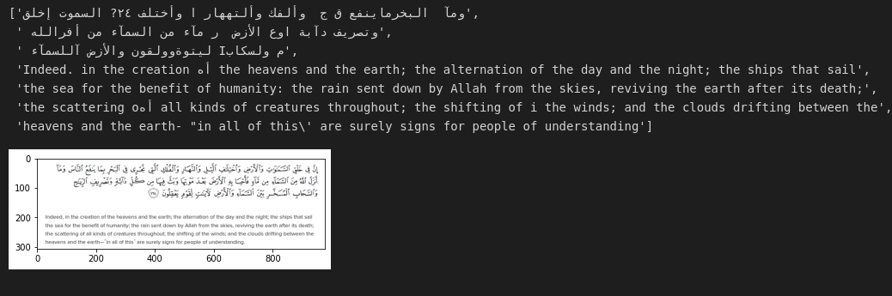
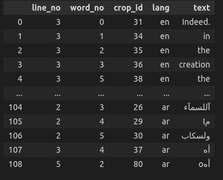

# TODO (Dev branch)

**entry from**: ```test.ipynb```

- [x] pipe english recognizer paddle
- [x] pipe arabic recognizer paddle
- [x] line and word based document sorting
- [x] requirement versioning
- [x] integrate classifier model
- [ ] inverse arabic order
- [x] bangla recognizer: 
    - [x] base version(temporary): easyocr integration with freelist crops (integrate easyocr and paddleocr)
    - [ ] cluster version (temporary): word modification and cleaning pipeline
- [x] ```text_dict``` as universal call variable
    - [x] line based sort visualization 
    - [x] filter false word dets with line=-1 iden
    


**legacy states**:

* line-word image with filtered noise


* sample arabic eng mixer




